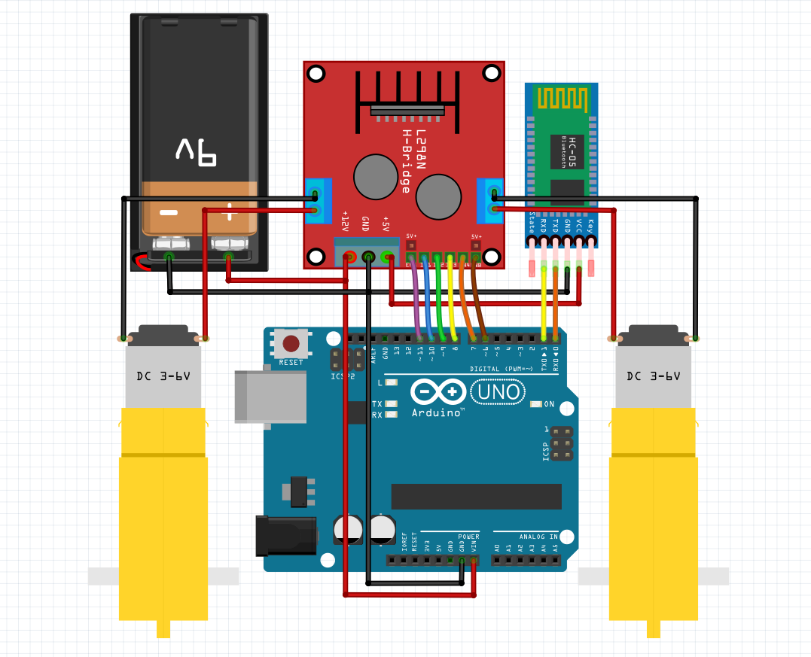

# simple_robot
### Simple robot for beginners using Arduino Uno, HC 05, L298N
---
### 🧰 Components
- Arduino Uno
- L298N H-Bridge
- HC-05 Bluetooth Module
- 2 Yellow Gear Motors and Wheels
- 9V-12V Battery Pack
- Chassi
- Jumpers, Wires and Screws
---

### 🔌 Circuit Diagram

---

### 💻 Code Overview 

- The Arduino code listens for Bluetooth commands sent from a smartphone and controls the motors accordingly via the **L298N motor driver**.
- Currently, the robot runs at a **fixed speed**, which is set using `analogWrite()` on the enable pins.  
> This was implemented intentionally because **it's not recommended to leave the enable pins permanently jumped**.  
However, you can easily modify the code to adjust the speed dynamically using different PWM values (0-255). 

```cpp
void setup{
#define ENA 11 // PWM Pins
...
#define ENB 6 // PWM Pins
}

```
---

### 🔢 Steps
1) Upload the code to your Arduino UNO 
  -  ⚠️ Disconnect the HC-05(RX/TX) while uploading code to avoid serial conflict 
2) Connect all components according to the circuit diagram 
3) Install a Bluetooth controller app on your smartphone;
4) Pair with the HC-05 module (default PIN is usually 1234 or 0000) 
5) Setup your gamepad to send the following commands 
   - W - Move Forward 
   - S - Move Backward 
   - A - Turn Left 
   - D - Turn Right 

   ---
   
